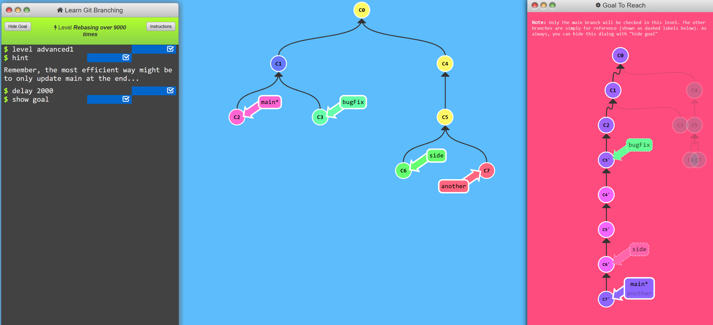
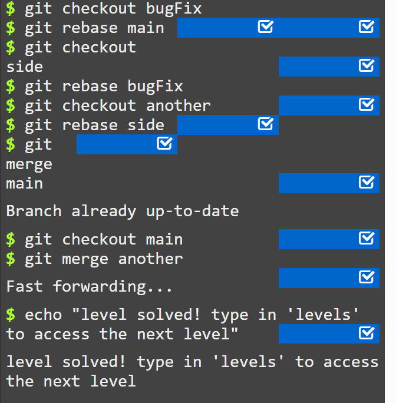
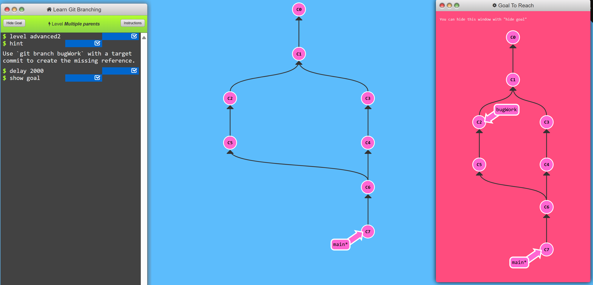
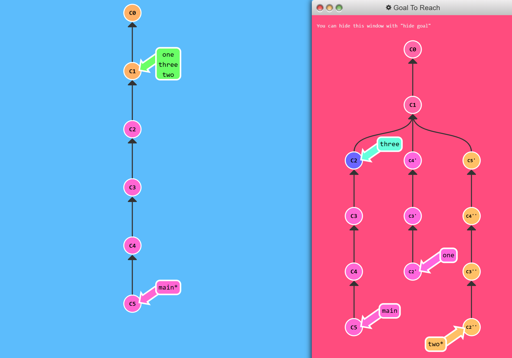
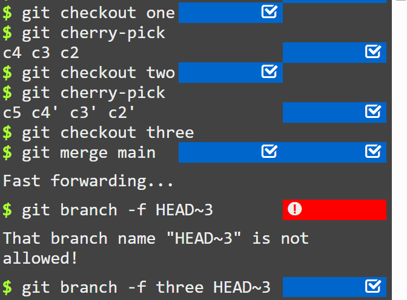

# For the truly brave!

## 1. Rebasing over 9000 times!

**Problem:**\

* to rebase all work from branches onto main
* the commits wants all to be in sequential order 

**Solution:**

## 2. Multiple Parents

* \~ modifier takes optional number specifying what number of generations to go back
* ^ modifier also specifies which parent reference to follow from merge commit
* git normally follows first parent, but we can specify number with ^ to change default behaviour.

**Problem:**\
To complete this level, create a new branch at the specified destination: 

**Solution:**\
Just create bugWork branch in C2 commit.\
`git branch bugWork C2`

## 3. Branch Spaghetti

* `main` is few commits ahead of `one`, `two`and `three` branches.
* to update these 3 branches with modified versions of last few commits on main.
* Branch one needs a re-ordering of those commits and an exclusion/drop of C5.
* Branch two just needs a pure reordering of the commits.
* Branch three only needs one commit transferred. 

**Solution:**\

* cherry-pick required commits from main branch
* continue cherry-picking from two branches
* forcebranch to commit c2 using `git branch -f three HEAD~3`
