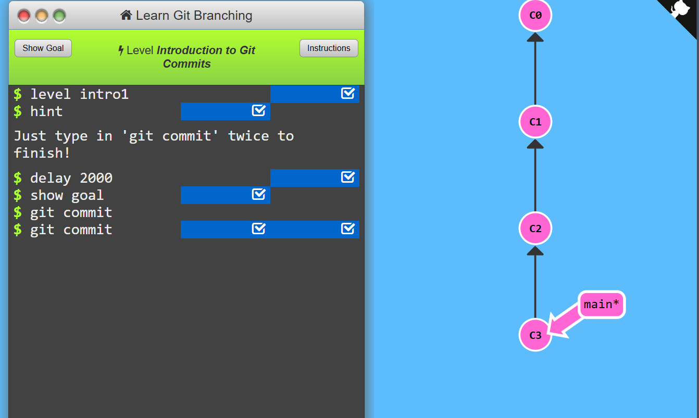
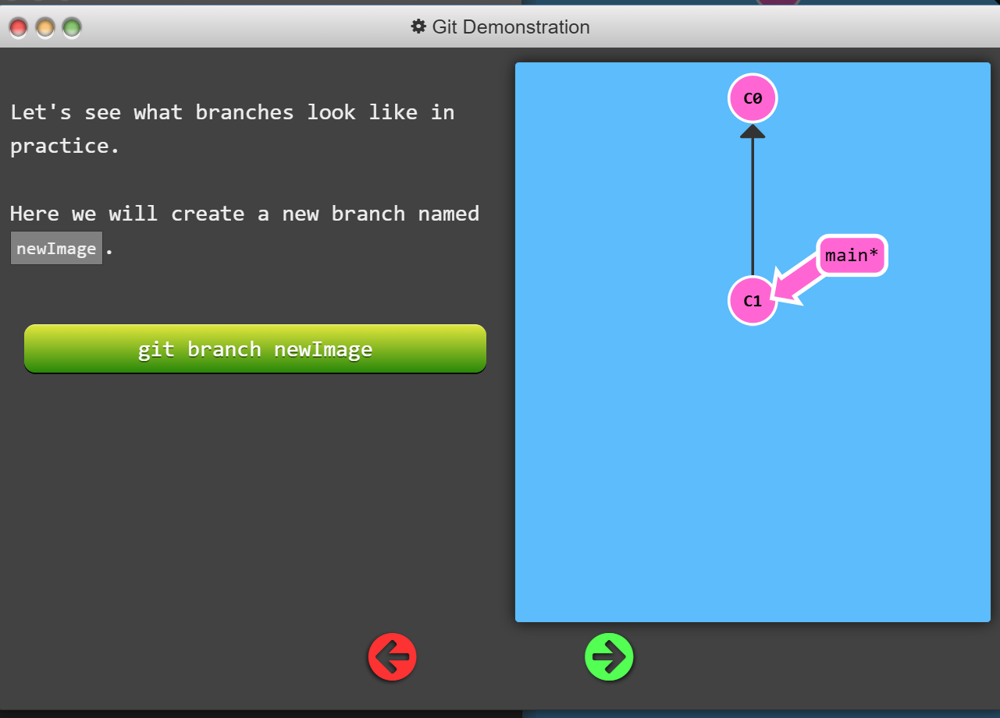
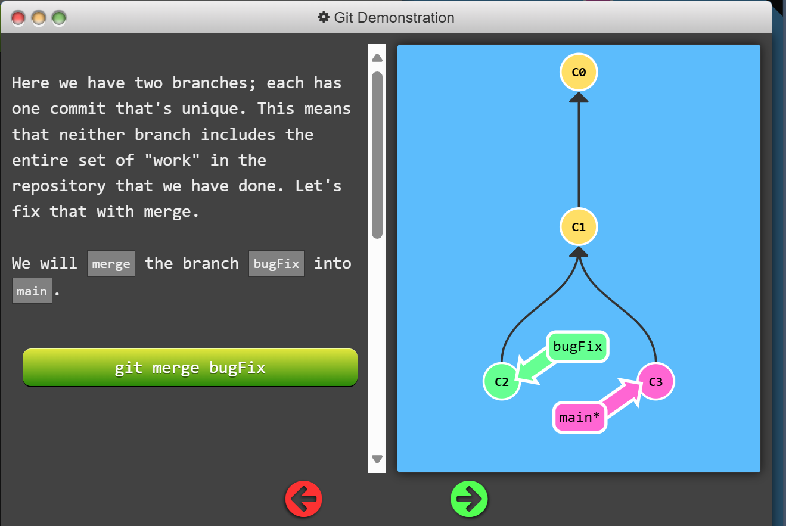
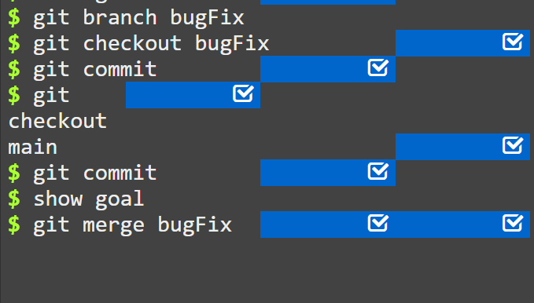
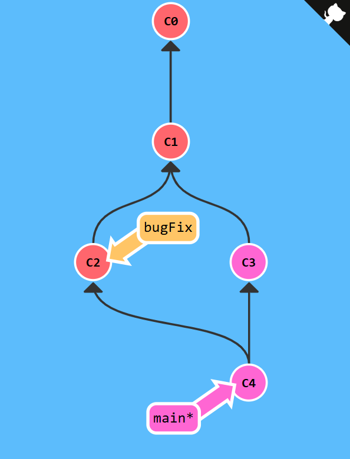

# Introduction Sequence

## 1. Git Commits

> A commit in a git repository records a snapshot of all the (tracked) files in your directory. It's like a giant copy and paste, but even better!

The challenge includes the usage of `git commit` command. 

## 2. Branching in Git

This shows usage of `git branch` command. `git checkout -b bugFix` or simply `git branch bugFix`

## 3. Merging in Git

`git merge` is a command used to combine branches together. Merging in Git creates a special commit that has two unique parents. A commit with two parents essentially means "I want to include all the work from this parent over here and this one over here, and the set of all their parents."  We can use git checkout and then git merge to just attach bugfix to main.\
To complete this level, do the following steps:

* Make a new branch called bugFix
* Checkout the bugFix branch with git checkout bugFix
* Commit once
* Go back to main with git checkout
* Commit another time
* Merge the branch bugFix into main with git merge  

## 4. Git Rebase

The second way of combining work between branches is rebasing. Rebasing essentially takes a set of commits, "copies" them, and plops them down somewhere else.\
While this sounds confusing, the advantage of rebasing is that it can be used to make a nice linear sequence of commits. The commit log / history of the repository will be a lot cleaner if only rebasing is allowed.

Following example shows the use of `git rebase`: 

Now we are checked out on the main branch. Let's go ahead and rebase onto bugFix. Since main was an ancestor of bugFix, git simply moved the main branch reference forward in history.\
To complete this level, do the following

* Checkout a new branch named bugFix
* Commit once
* Go back to main and commit again
* Check out bugFix again and rebase onto main **Solution:** 
