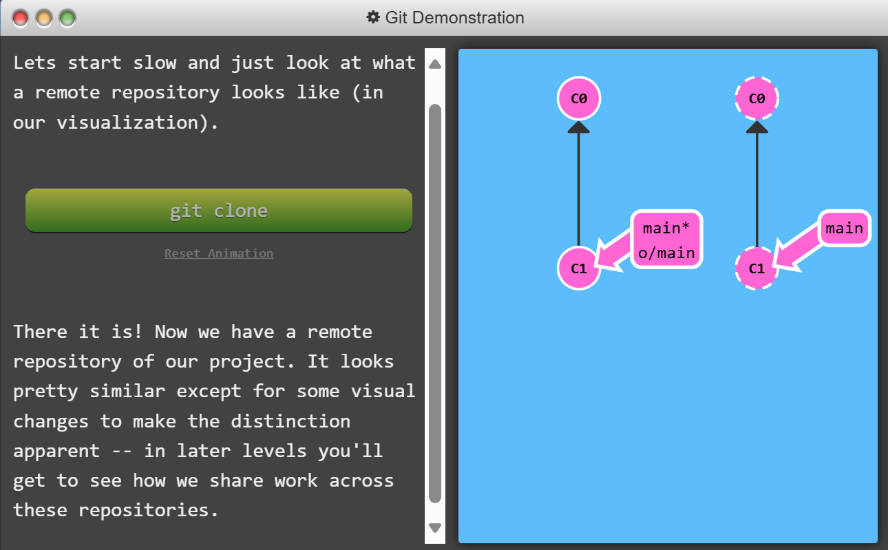
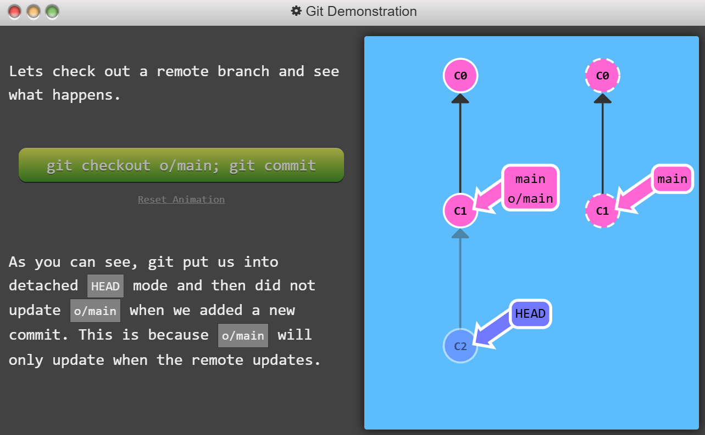
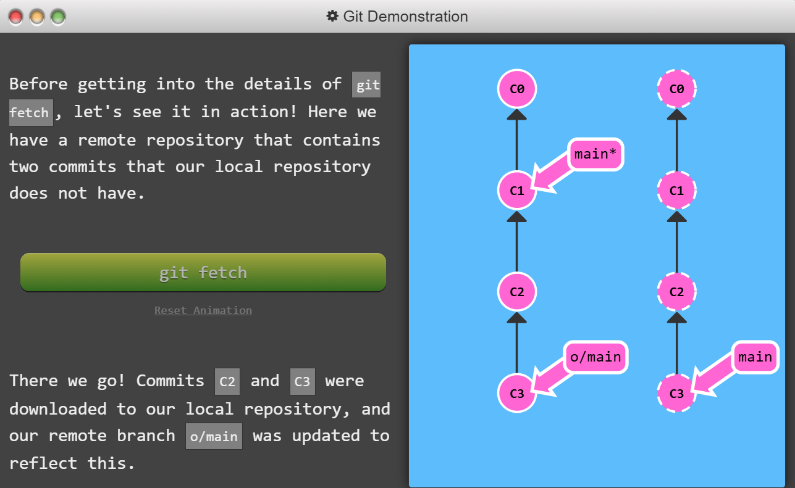
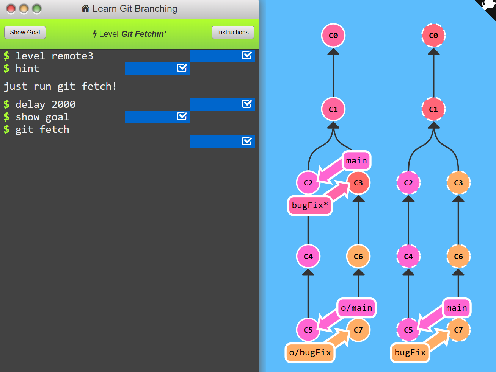
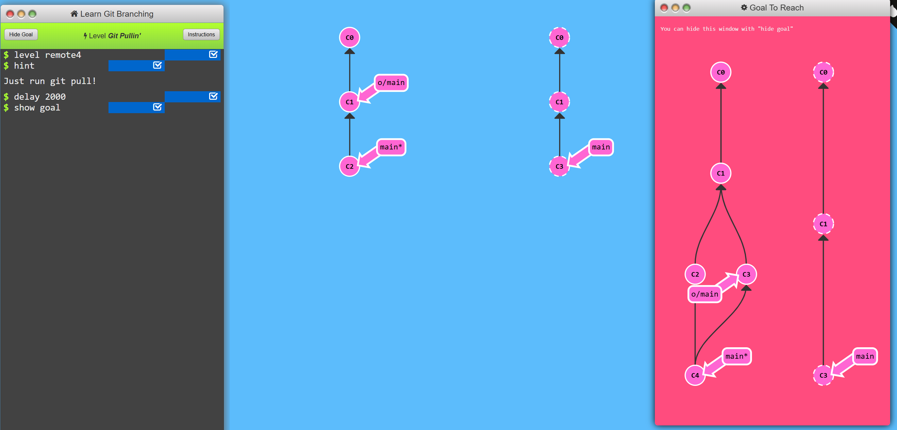
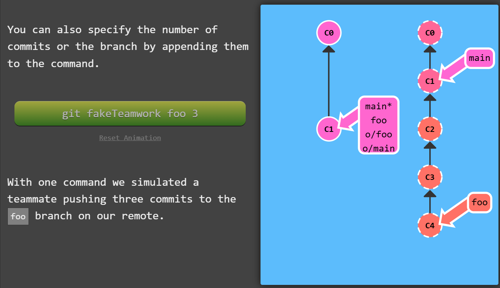
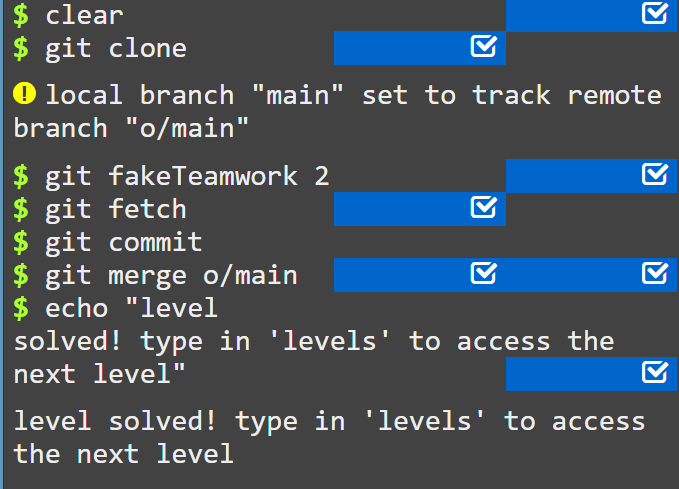
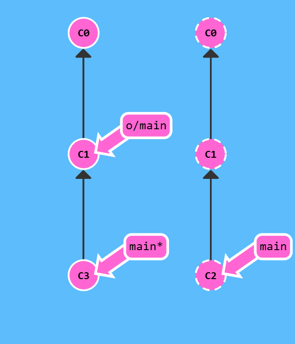
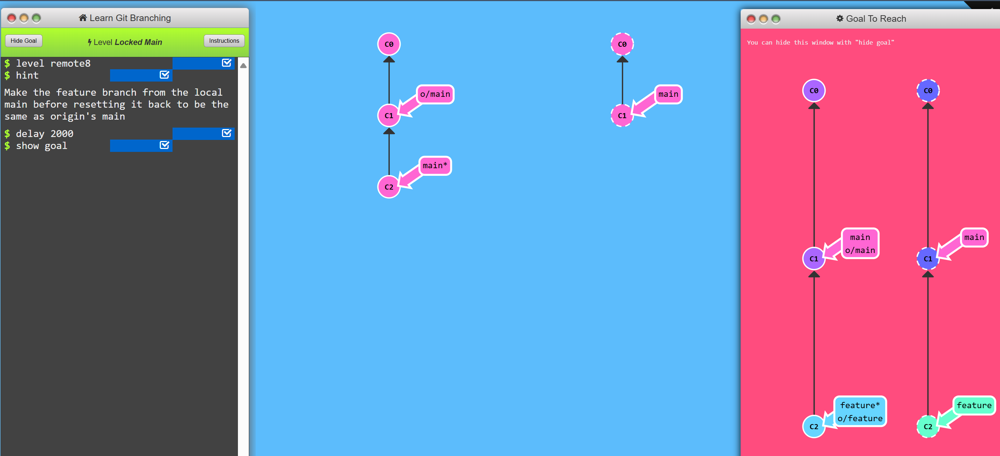
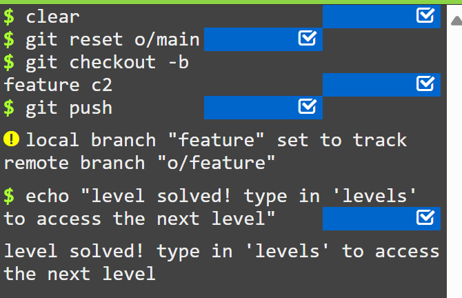

# Push & Pull -- Git Remotes

## 1. Clone Intro

### Properties of remote repos

* serves as backup
* everyone can contribute

Normally `git clone` is used to create local copies of remote repos, **here we will make remote repo out of local one.** 

To solve this level we just have to `git clone` our local repo.

## 2. Git Remote Branches

* Remote branches reflect the state of remote repositories.
* Remote branches have the special property that when you check them out, you are put into detached HEAD mode.

> To be clear: Remote branches are on your local repository, not on the remote repository.

What is o/?

* `<remote name>/<branch name>`
* for branch o/main, the branch name is `main` and remote is `o`. 

**Problem:**\
To finish this level, commit once off of main and once after checking out o/main. This will help drive home how remote branches behave differently, and they only update to reflect the state of the remote. 

**Solution:**\

* we are in main branch just `git commit` this will create new commit -we checkout o/main and commit we will be in detached HEAD.
* none of this brings change to our remote repo because we haven't pushed yet.

## 3. Git Fetch

Fetch data from remote repo.  Here initially remote repo has 2 more commits more than local one so hence if we want to update our local repo to remote we need to fetch first.

> Notice only remote branch has been updated. `main` branch is still behind in local repo.

What **fetch** does?

* downloads commits that are in remote and missing in local repo. It basically syncs local and remote repos.
* updates where remote branch points (o/main)

> `git fetch` usually talks to the remote repository through the Internet (via a protocol like `http://` or `git://`).

What **fetch** doesn't do?

* doesn't change anything about local state
* will not update `main` branch
* change anything how file system looks

To finish the level, simply `git fetch` and download all the commits. 

## 4. Git Pull

Same as merging a fetch.  Here the commits are not fetched and merged, let's see what happens after `git fetch; git merge o/main` 

This exact same task is done by using a single command `git pull`.

**Problem:**\

**Solution:**\
 Or you can just use `git pull`

## 5. Simulating collaboration

* This level includes a aptly-named command `git fakeTeamwork`
* The default behavior of fakeTeamwork is to simply plop down a commit on main. 

**Problem:**\
Go ahead and make a remote (with git clone), fake some changes on that remote, commit yourself, and then pull down those changes. It's like a few lessons in one. 

**Solution:**\

* we clone local repo
* we add 2 commits to remote repo using `git fakeTeamwork` to pretend someone has contributed in our remote repo.
* we then fetch the changes first
* we commit the change
* we merge to remote branch ie o/main

## 6. Git Push

* used for uploading changes on local repo to remote repo
* after push remote branch and main branch should be at same place

To finish this level, simply share two new commits with the remote. Strap in though, because these lessons are about to get a lot harder

* git commit 2 times
* git push

## 7. Diverged Work

* when the remote branch is already ahead of your local branch we cannot push the changes to it, or it doesn't allow because the changes would br ambigious
* How do you resolve this situation? It's easy, all you need to do is base your work off of the most recent version of the remote branch. 
* This problem can be solved by using fetch and rebase
  * after we fetch changes to remote repo we rebase our work to reflect new changes in remote and we push using `git push`
* another solution us `git merge`
  * we fetch first like in previous method.
  * merge the changes to remote branch
  * push the changes
* another way is, `git pull` is just shorthand for a **fetch** and a **merge**. Conveniently enough, `git pull --rebase` is shorthand for a **fetch** and a **rebase**!

In order to solve this level, take the following steps:

* Clone your repo
* Fake some teamwork (1 commit)
* Commit some work yourself (1 commit)
* Publish your work via rebasing

**Solution:**\

* we clone the local repo
* we commit from local and fakecommit from remote
* we can either `git fetch` `git rebase o/main` and push
* or directly `git pull --rebase` and push
* both will give same output

## 8. Remote Rejected!

If you work on a large collaborative team it's likely that main is locked and requires some Pull Request process to merge changes. If you commit directly to main locally and try pushing you will be greeted with a message similar to this:

`! [remote rejected] main -> main (TF402455: Pushes to this branch are not permitted; you must use a pull request to update this branch.)`

#### Why was it rejected?

\- the policy is to require pull requests instead of directly pushing commits to main - \*\*cause of error:\*\* somehow you did push directly on main without creating a branch and sending a pull request

#### The solution

\- create a new branch - push that to remote - reset main back to be in sync with remote to not get issues while doing a pull and someone else's commit conflict with yours.\

**Problem:** 

**Solution:**\

* reset main branch to remote branch
* create a feature branch on commit c2
* push the branch 
