# git-writeups

## **Introduction Sequence**

### Introduction to Git Commits

A commit in a Git repository records a snapshot of all the (tracked) files in your directory.

### Level intro1

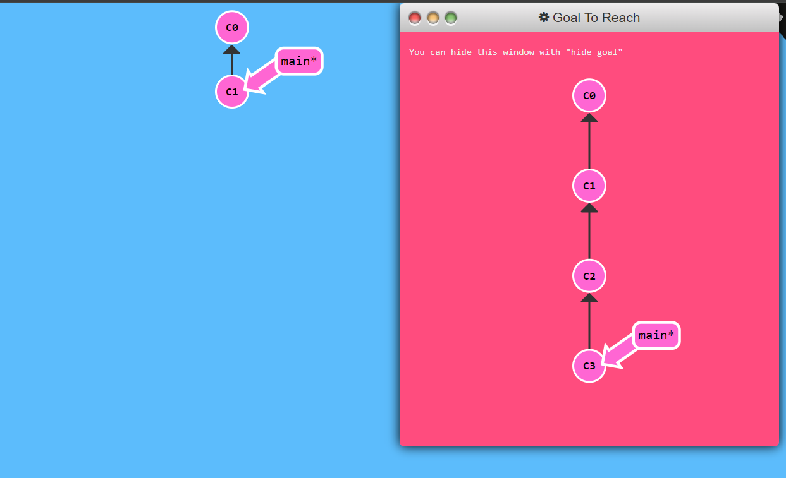

Hint: Just type in “git commit” twice to finish

Commands to solve the level:

git commit

git commit

### Branching in Git

Branches in Git are incredibly lightweight as well. They are simply pointers to a specific commit -- nothing more.

### Level intro2

Hint: Make a new branch with “git branch” and check it out with “git checkout”

Commands used:

git branch bugFix

git checkout bugFix

### Merging in Git

In Git, branches allow you to develop features, fix bugs, or experiment in isolation from the main codebase, while merging integrates changes from different branches into a single unified branch, facilitating collaboration and version control.

### Level intro3

Hint: Remember to commit in the order specified (bugFix before main)

Commands:

git branch bugFix

git checkout bugFix

git commit

git checkout main

git commit

git merge bugFix

### Rebase Introduction

Git rebase is a command that allows you to integrate changes from one branch into another by moving or combining a sequence of commits, providing a cleaner project history.

### Level intro4

Hint: Make sure you commit from bugFix first

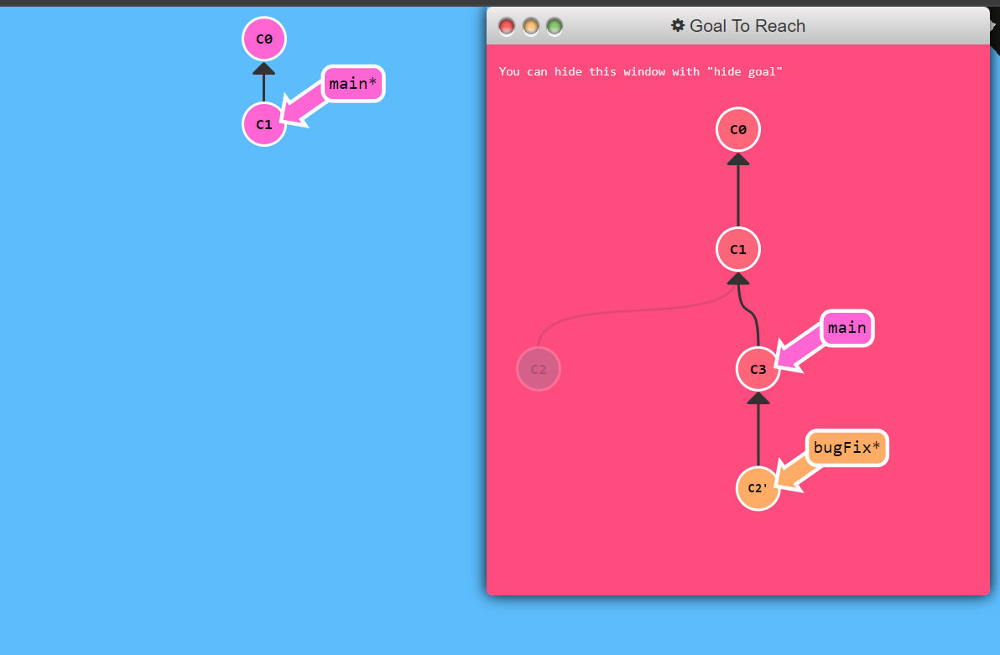

Commands:

git checkout -b bugFix

git commit

git checkout main

git commit

git checkout bugFix

git rebase main

## **Ramping up**

### Detach yo' HEAD

In Git, "detaching the HEAD" means checking out a commit that is not associated with any branch.

### Level rampup1

hint: use the label (hash) on the commit for help

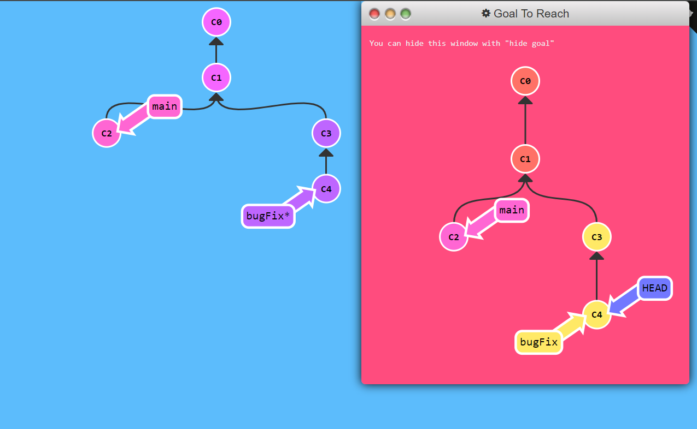

Command:

git checkout C4

### Relative Refs (^)

In Git, relative references (relative refs) allow you to refer to commits in a way that is relative to a given starting point, typically the current commit (HEAD).

### Level rampup2

hint: Remember the caret (^) operator

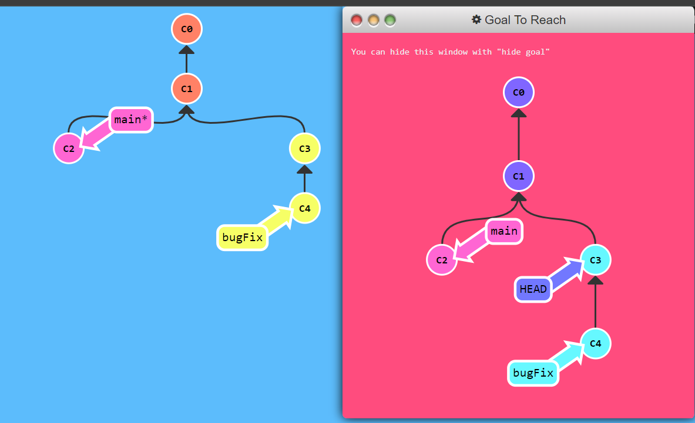

Command:

git checkout bugFix^

### Relative Refs #2 (\~)

### Level rampup3

hint: you need to use at least one direct reference (hash) to complete this level.

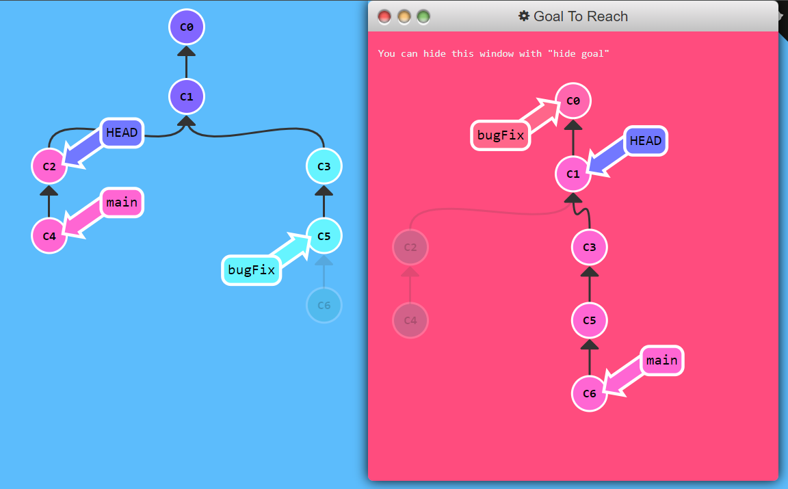

Commands:

git branch -f main c6

git branch -f bugFix c0

git checkout c1

### Reversing Changes in Git

In Git, relative references (relative refs) allow you to refer to commits in a way that is relative to a given starting point, typically the current commit (HEAD). They are useful for navigating the commit history efficiently.

### Level rampup4

hint: Notice that revert and reset take different arguments

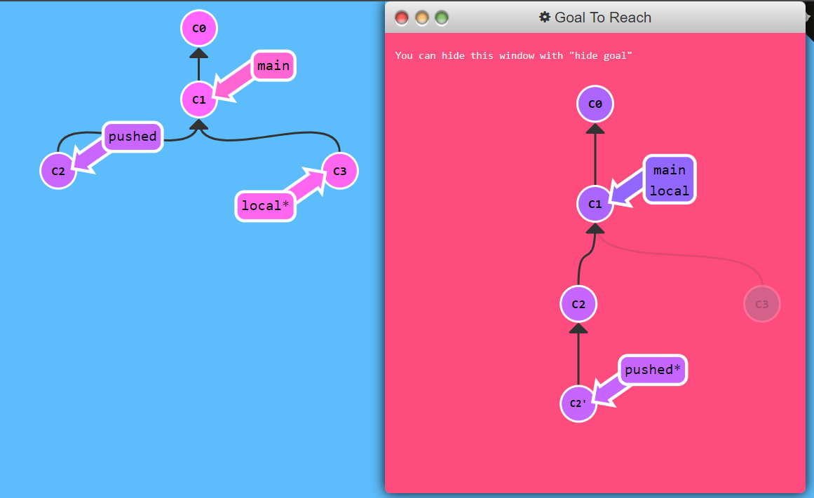

Commands:

git reset local\~1

git checkout pushed

git revert pushed

## **Moving Work Around**

#### 1: Cherry-pick Intro

Git cherry-pick is a command used to copy a specific commit from one branch and apply it onto another branch.

### level move1

hint: git cherry-pick followed by commit names

Command:

git cherry-pick c3 c4 c7

### Interactive Rebase Intro

Git interactive rebase is a powerful tool that allows you to change the commit history of your branch before you push your changes to a remote repository.

### level move2

hint: you can use either branches or relative refs(HEAD\~) to specify the rebase target

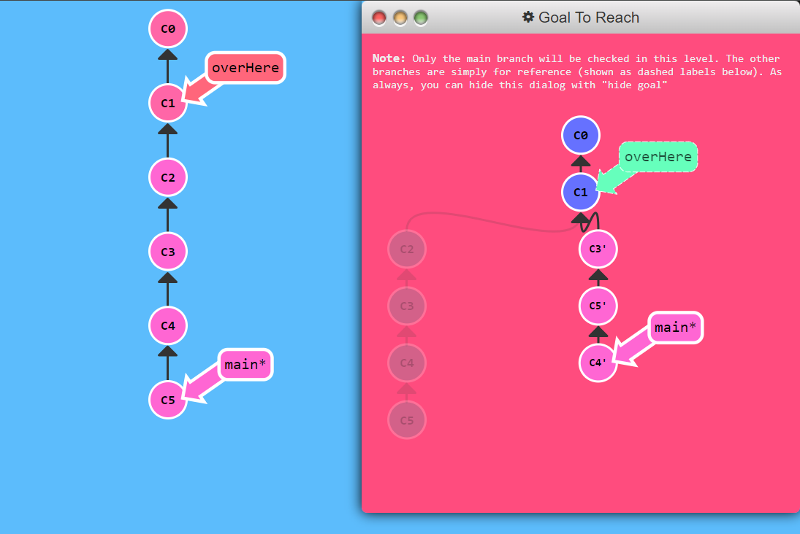

Command:

git rebase -i HEAD\~5

In the interactive rebase:

* C1
* omit C2
* C3
* C5
* C4

## **A Mixed Bag**

#### 1: Grabbing Just 1 Commit

### level mixed1

hint: Remember, interactive rebase or cherry-pick is your friend here

Commands:

git checkout main

git cherry-pick c4

#### 2: Juggling Commits

### level mixed2

hint: The first command is git rebase -i HEAD\~2

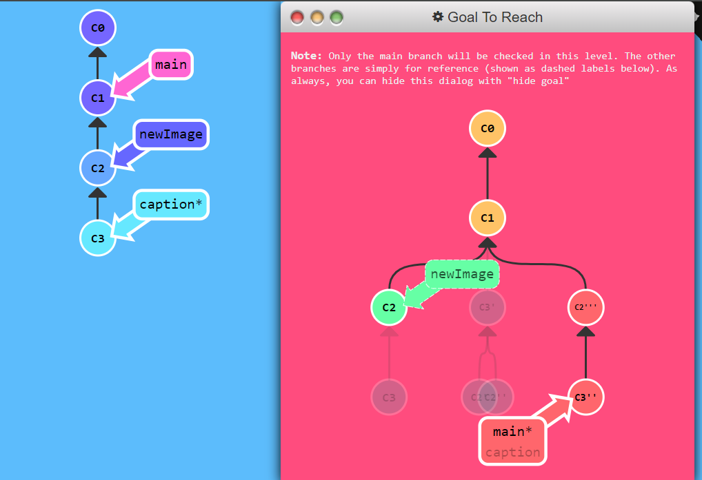

Commands:

git rebase -i HEAD\~2

git commit —amend

git rebase -i HEAD\~2

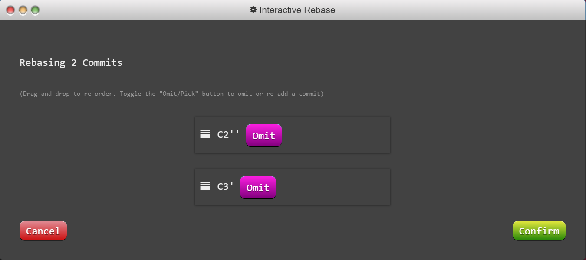

git branch -f main caption

#### 3: Juggling Commits #2

### level mixed3

hint: Don’t forget to forward main to the updated changes!

Commands:

git checkout main

git cherry-pick c2

git commit —amend

git cherry-pick c3

#### 4: Git Tags

### level mixed4

hint: you can either check out the commit directly or simply checkout the tag

Commands:

git tag v0 c1

git tag v1 c2

git checkout v1

#### 5: Git Describe

### level mixed5

hint: Just commit once on bugFix when you’re ready to move on

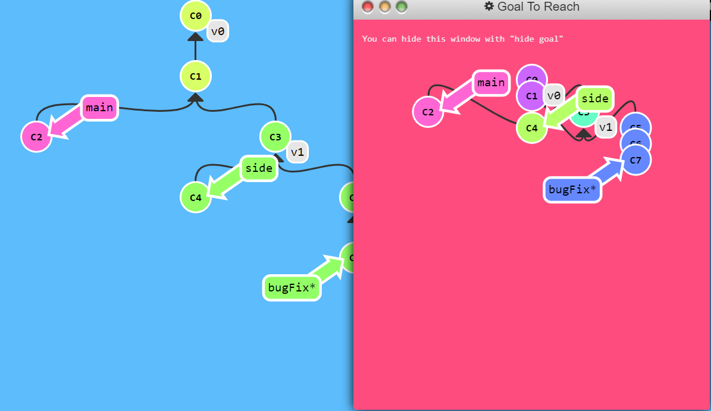

Command:

git commit -m bugFix

## **Advanced Topics**

#### 1: Rebasing over 9000 times

### level advanced1

hint: Remember, the only efficient way might be to only update main at the end. . .

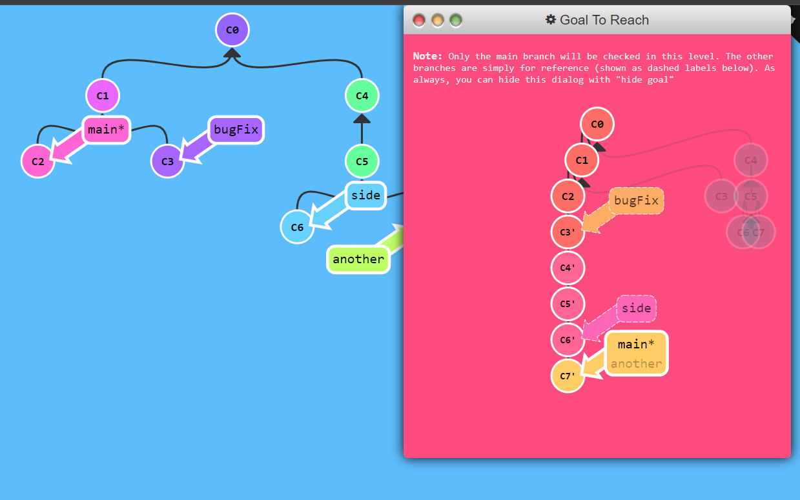

### In 7 commands

git checkout bugFix

git rebase main

git checkout side

git rebase bugFix

git checkout another

git rebase side

git branch -f main

### In 4 commands

git rebase main bugFix

git rebase bugFix side

git rebase side another

git rebase main side

#### 2: Multiple parents

### level advanced2

hint: use ‘git branch bugWork’ with a target commit to create a missing reference.

Command:

git branch bugWork HEAD\~^2\~

#### 2: Multiple parents

### level advanced3

Make sure to do everything in proper order! Branch one first, then two, then three

Commands:

git checkout one

git cherry-pick c4 c3 c2

git checkout one

git cherry-pick c5 c4 c3 c2

git branch -f three c2
